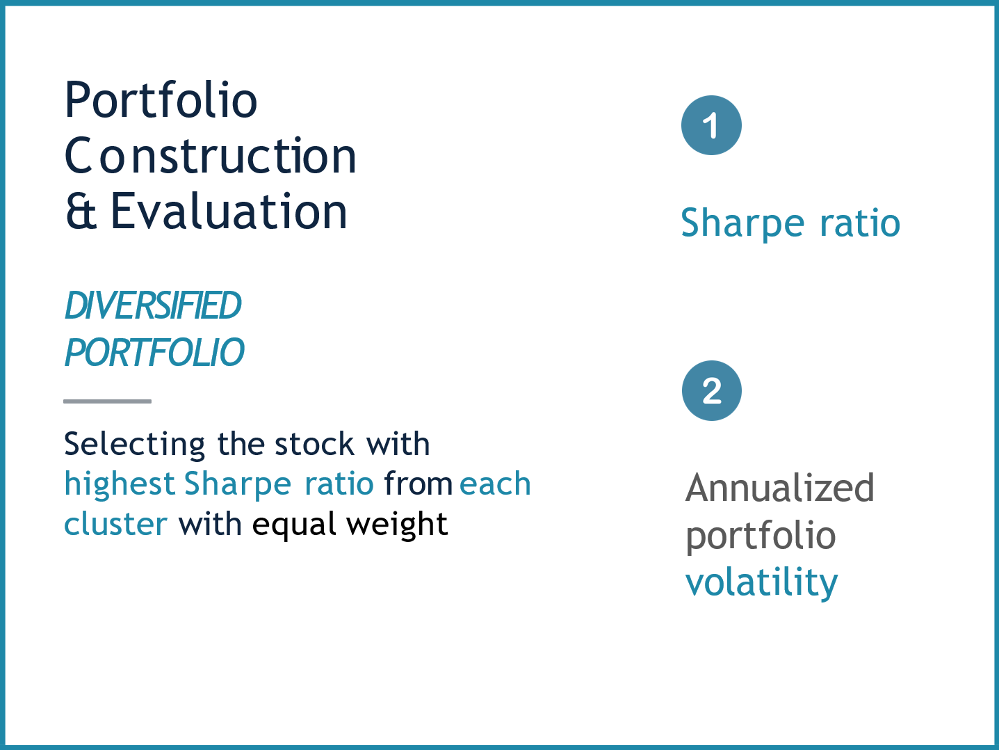
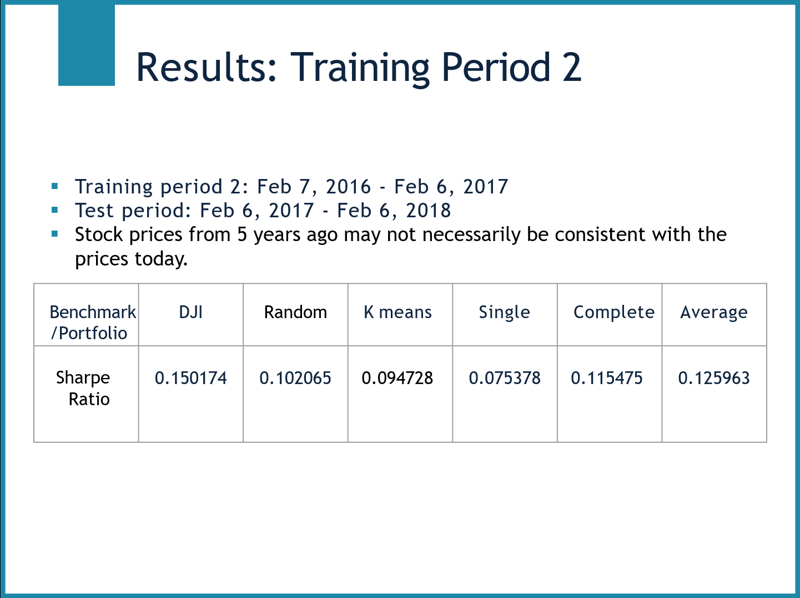
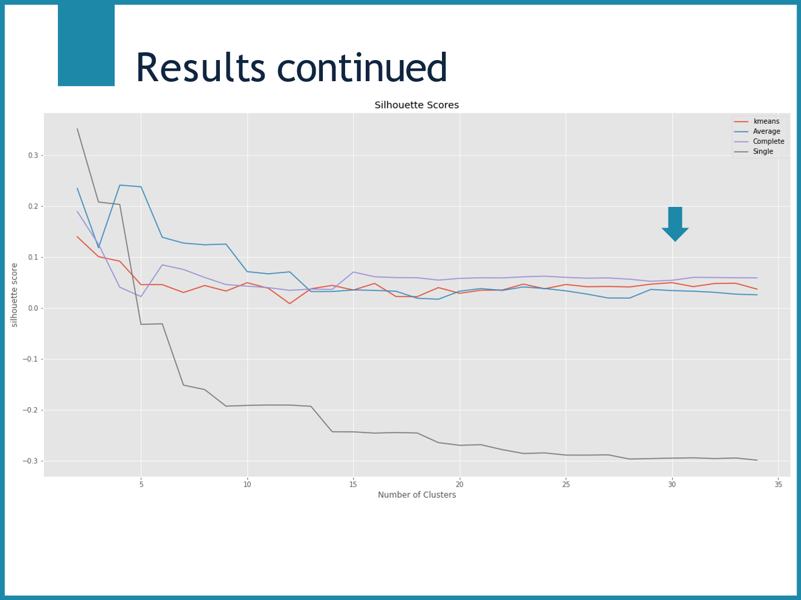
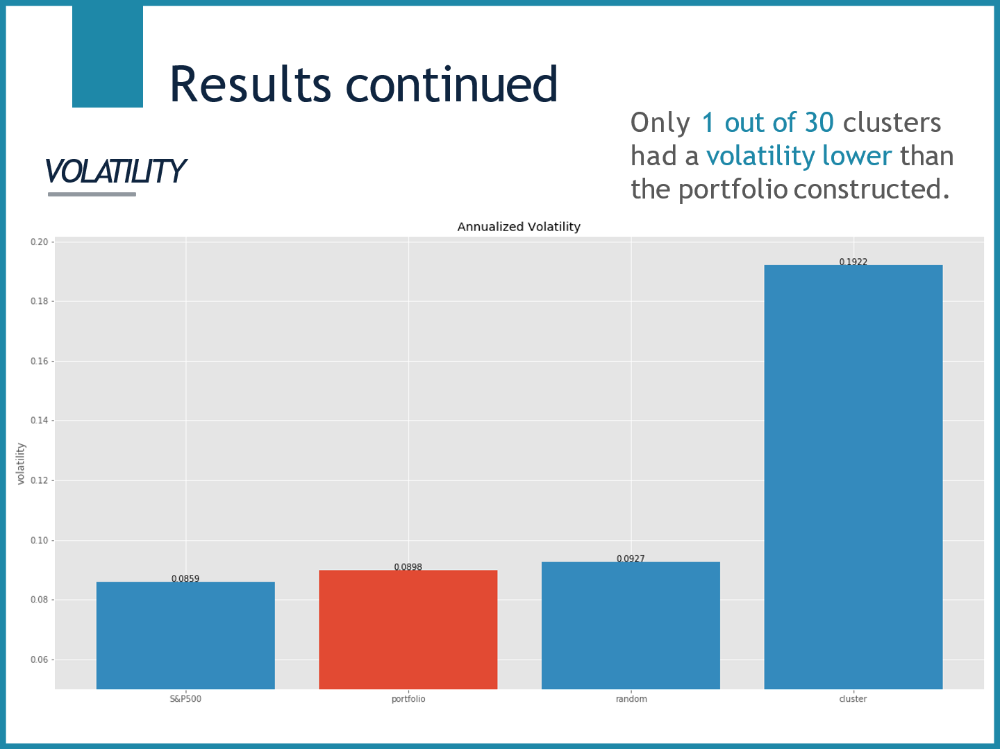

# Portfolio Diversification Based on Clustering Analysis (Project Lead)

+ **Objectives**: In this project, we use clustering algorithms to create a diversified portfolio to reduce volatility and reduce the overall risk of an investment portfolio.
+ **Summary**: The goal of this project is to construct a well-diversified portfolio using clustering. We trained 4 different models: (1) k-means clustering with daily log returns as features and (2) agglomerative (hierarchical) clustering methods based on correlation distances with single linkage, (3) complete linkage, (4) and average linkage.


    By selecting the stock with the highest Sharpe ratio from each cluster, 4 equally weighted portfolios are constructed each consisting of 30 stocks. Based on silhouette scores and Sharpe ratio, agglomerative clustering with average linkage trained on last one year of data is selected as the final model.
    
    
    
    The performance of the selected portfolio in the test period in terms of Sharpe ratio performed better than random selection but worse than DJIA. Results in terms of volatility showed better performance; the selected portfolio had an annualized volatility lower than random selection as well as the average volatility of all clusters and fairly close to that of equally weighted portfolio consisting of all 470 stocks in the data. Also, only one out of 30 clusters had a volatility lower than that of the selected portfolio. The following suggestions are made for improvements and further studies:
    + Other metrics can be used as alternatives of Sharpe Ratio: Sortino Ratio,Value-at-Risk, etc.
    + Adjust length of training period and number of clusters
    + Change/extend pool of stocks
    + Implement distance thresholds
    + Assign weights on each stock of the portfolio based on an optimization problem to maximize Sharpe ratio
    + Add/utilize industry sector information for each company
    + Use time series analysis to describe the changes in stock prices throughout the duration
    
+ **Contributions**:
    +	Led group of five graduate students to build and train machine learning models using K-means clustering and Agglomerative clustering in Python in order to construct a diversified portfolio of 30 stocks.
    +	Evaluated performance using Sharpe ratio and annualized volatility of the portfolio in comparison to market volatility and volatility of each cluster, concluding the portfolio is well diversified in terms of volatility.
    +	Communicated results and made suggestions for improvement in forms of verbal presentation and written report.
    
+ **Keywords**: Clustering (K-means, Hierarchical), Unsupervised Learning, Portfolio Diversification, Sharpe Ratio, Volatility, Python

```
proj/
├── data/ data used in the analysis. 
├── doc/ final deliverables such as the analysis, report, and presentation files.
└───── figs/ figures
```

Please see each subfolder for a README file.

